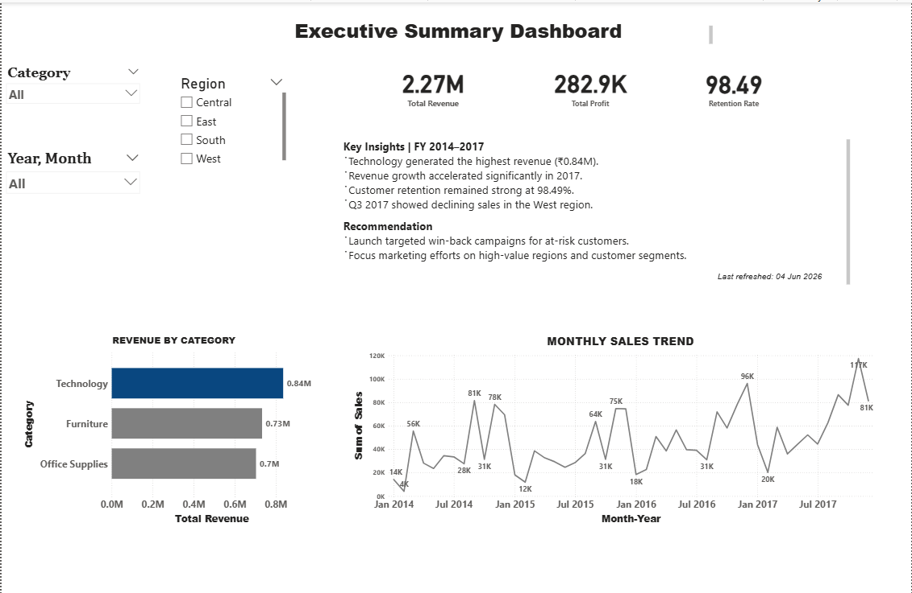
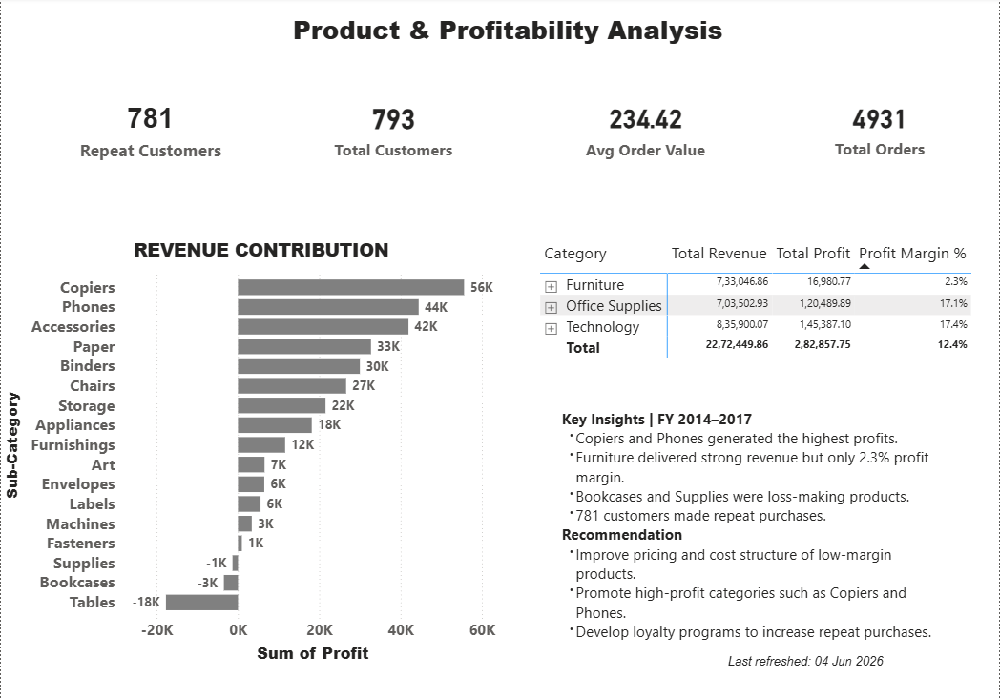

# Luxury Retail Customer Intelligence & Retention Analytics

## Project Overview

This project analyzes retail customer and sales data using SQL and Power BI to uncover customer behavior patterns, retention trends, sales performance, product profitability, and business growth opportunities.

The objective was to transform raw transaction data into actionable business insights through SQL-based analysis and interactive Power BI dashboards.

## Dashboard Preview

### Executive Summary Dashboard

### Product & Profitability Dashboard

## Power BI Dashboards

The Power BI solution contains two executive dashboards built from multiple SQL analyses.

### 1. Executive Summary Dashboard

**Built from:** Sales Analysis, Customer Behavior Analysis, and Retention Analysis

**KPIs**

* Total Revenue: $2.27M
* Total Profit: $282.9K
* Customer Retention Rate: 98.49%

**Visualizations**

* Revenue by Category
* Monthly Sales Trend
* Region Filters
* Category Filters
* Year & Month Filters

**Key Insights**

* Technology generated the highest revenue ($0.84M).
* Revenue growth accelerated significantly in 2017.
* Customer retention remained strong at 98.49%.
* Q3 2017 showed declining sales performance in the West region.

### 2. Product & Profitability Analysis Dashboard

**Built from:** Product Performance Analysis, Customer Intelligence, and Profitability Analysis

**KPIs**

* Repeat Customers: 781
* Total Customers: 793
* Average Order Value: $234.42
* Total Orders: 4,931

**Visualizations**

* Revenue Contribution by Sub-Category
* Profit Margin by Category
* Product Profitability Analysis
* Repeat Customer Metrics

**Key Insights**

* Copiers and Phones generated the highest profits.
* Furniture delivered strong revenue but only a 2.3% profit margin.
* Bookcases and Supplies were identified as loss-making products.
* 781 customers made repeat purchases.

**Note:** Data cleaning, transformation, sales analysis, customer behavior analysis, retention analysis, product performance analysis, and profitability analysis were performed in SQL. Power BI was used to build interactive dashboards and visualize the final insights.

## Tools Used

* MySQL
* Power BI
* SQL
* Data Analytics
* Business Intelligence

## Analysis Performed

### Customer Intelligence & Retention Analysis

* Customer Behavior Analysis
* Customer Retention Analysis
* Repeat Customer Analysis
* Customer Segmentation Analysis

### Sales Analysis

* Revenue Analysis
* Monthly Sales Trend Analysis
* Regional Sales Analysis
* Category Performance Analysis
* Average Order Value Analysis

### Product Performance & Profitability Analysis

* Product Performance Analysis
* Profit Contribution Analysis
* Profit Margin Analysis
* Loss-Making Product Identification

## Key Business Insights

### Executive Summary Dashboard

* Technology generated the highest revenue ($0.84M).
* Revenue growth accelerated significantly in 2017.
* Customer retention remained strong at 98.49%.
* West region sales weakened during Q3 2017.

### Product & Profitability Dashboard

* Copiers and Phones generated the highest profits.
* Furniture produced strong revenue but delivered only a 2.3% profit margin.
* Bookcases and Supplies were identified as loss-making products.
* 781 customers made repeat purchases.

## Business Recommendations

* Launch targeted win-back campaigns for at-risk customers.
* Improve pricing and cost structures for low-margin categories.
* Reassess inventory and marketing strategies for loss-making products.
* Increase focus on high-profit products and repeat-customer retention initiatives.

## Dashboard KPIs

* Total Revenue: $2.27M
* Total Profit: $282.9K
* Customer Retention Rate: 98.49%
* Repeat Customers: 781
* Average Order Value: $234.42
* Total Orders: 4,931

## Project Deliverables

* SQL Analysis Queries
* Executive Summary Dashboard
* Product & Profitability Dashboard
* Business Insights & Recommendations
* Project Documentation
