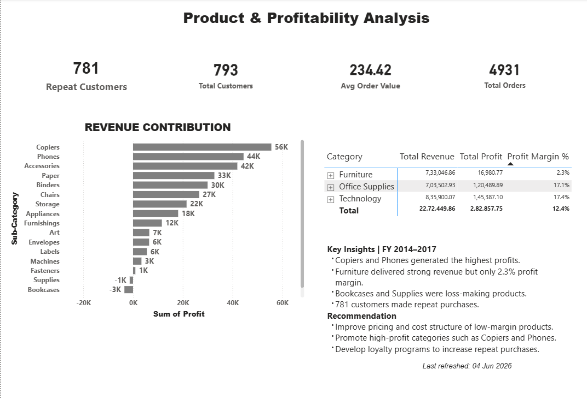

# Luxury Retail Customer Intelligence & Retention Analytics

## Project Overview

This project analyzes luxury retail customer and sales data using SQL and Power BI to uncover customer behavior patterns, retention trends, product performance, profitability drivers, and business growth opportunities.

The objective was to transform raw retail transaction data into actionable business insights through SQL analysis and interactive Power BI dashboards.

## Dashboard Preview

### Executive Summary Dashboard

### Product & Profitability Dashboard  

## Power BI Dashboards

The `.pbit` template contains 2 executive dashboards that visualize insights from 7 comprehensive SQL analyses:

### 1. Executive Summary Dashboard
**Built from:** Sales Analysis + Customer Behavior + Retention Analysis
- **KPIs:** 2.27M Total Revenue, 282.9K Total Profit, 98.49 Retention Rate
- **Views:** Revenue by category, monthly sales trend, region/year filters
- **Key Insight:** Technology leads at ₹0.84M revenue, 98.49% retention rate maintained FY 2014-2017

### 2. Product & Profitability Analysis  
**Built from:** Product & Performance + Customer Intelligence & Segmentation
- **KPIs:** 781 Repeat Customers, 793 Total Customers, 234.42 Avg Order Value, 4,931 Total Orders
- **Views:** Revenue contribution by sub-category, profit margin by category, loss-making products
- **Key Insight:** Furniture delivered strong revenue but only 2.3% profit margin. Copiers and Phones generated highest profits.

**Note:** All data cleaning, transformations, and advanced analytics were performed in SQL. Power BI connects to the final transformed tables for visualization.

## Tools Used

* SQL (MySQL)
* Power BI
* Data Analytics
* Business Intelligence

## Analysis Performed

### Customer Analysis

* Customer Segmentation
* Repeat Customer Analysis
* Customer Retention Analysis
* Customer Behavior Analysis

### Sales Analysis

* Revenue Analysis
* Monthly Sales Trend Analysis
* Category-wise Revenue Analysis
* Order Value Analysis

### Product & Profitability Analysis

* Product Performance Analysis
* Profit Contribution Analysis
* Profit Margin Analysis
* Loss-Making Product Identification

## Key Business Insights

### Executive Dashboard

* Technology generated the highest revenue (₹0.84M).
* Revenue growth accelerated significantly in 2017.
* Customer retention remained strong at 98.49%.
* Q3 2017 showed declining sales in the West region.

### Product & Profitability Dashboard

* Copiers and Phones generated the highest profits.
* Furniture produced strong revenue but delivered only 2.3% profit margin.
* Bookcases and Supplies were identified as loss-making products.
* 781 customers made repeat purchases.

## Business Recommendations

* Launch targeted win-back campaigns for at-risk customers.
* Improve pricing and cost structure of low-margin categories.
* Reassess inventory and marketing strategies for loss-making products.
* Increase focus on high-profit products and repeat-customer retention programs.

## Dashboard KPIs

* Total Revenue: ₹2.27M+
* Total Profit: ₹282.9K+
* Retention Rate: 98.49%
* Repeat Customers: 781
* Average Order Value: ₹234.42
* Total Orders: 4,931

## Project Deliverables

* SQL Analysis Queries
* Power BI Executive Summary Dashboard
* Power BI Product & Profitability Dashboard
* Business Insights & Recommendations
