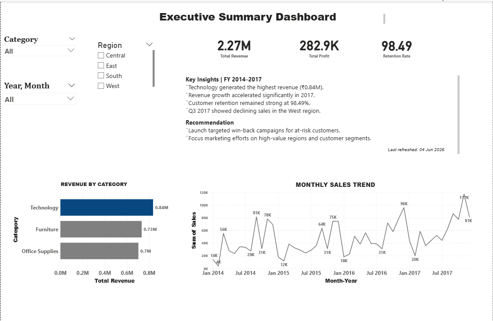
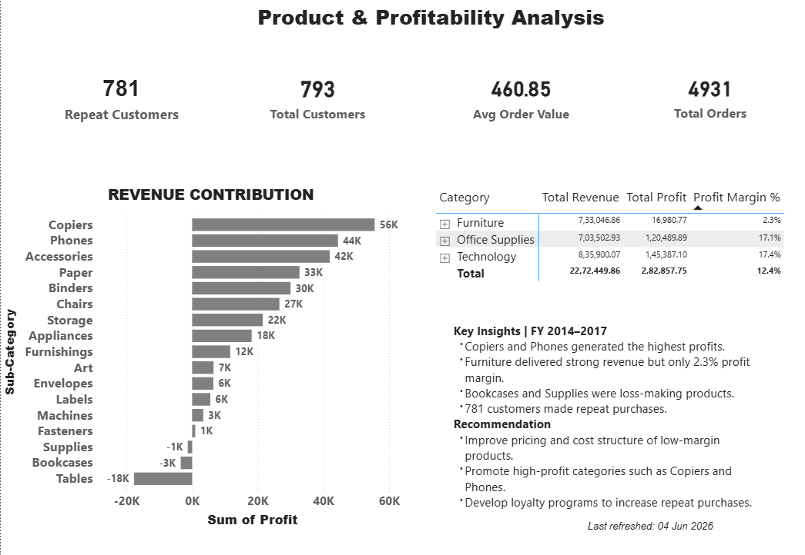

# Retail Customer Intelligence & Retention Analytics

## Project Overview

This project analyzes retail customer and sales data using SQL and Power BI to uncover customer behavior patterns, retention trends, sales performance, product performance, and business growth opportunities.

Sales, product, customer, and retention analysis were performed in SQL (MySQL). Profit and margin insights — total profit, profit margin by category, and loss-making products — were built directly in Power BI from the dataset's raw profit field, rather than through a separate SQL profitability pass.

## Dashboard Preview

### Executive Summary Dashboard

### Product & Profitability Dashboard

## Power BI Dashboards

### 1. Executive Summary Dashboard

**Built from:** SQL-based Sales Analysis and Customer Retention Analysis, visualized in Power BI with Region, Category, and Year/Month filters.

**KPIs**

* Total Revenue: $2.27M ($2,272,449.86)
* Total Profit: $282.9K
* Customer Retention Rate: 98.49%

**Visualizations**

* Revenue by Category
* Monthly Sales Trend
* Region Filters
* Category Filters
* Year & Month Filters

**Key Insights**

* Technology generated the highest revenue ($0.84M) — confirmed in SQL product/category revenue analysis.
* Sales are strongly seasonal, peaking in September–December (Q4) and dipping in January–February.
* Customer retention remained strong at 98.49% (SQL retention/churn analysis).
* Q3 2017 showed declining sales performance in the West region (from the Power BI regional view).

### 2. Product & Profitability Analysis Dashboard

**Built from:** SQL-based Product Performance Analysis and Customer Segmentation Analysis; profit and margin figures added in Power BI.

**KPIs**

* Repeat Customers: 781
* Total Customers: 793
* Average Order Value: $460.85
* Total Orders: 4,931

**Visualizations**

* Revenue Contribution by Sub-Category
* Profit Margin by Category
* Product Profitability Analysis
* Repeat Customer Metrics

**Key Insights**

* Copiers and Phones generated the highest profits (Power BI profitability view).
* Furniture delivered strong revenue but only a 2.3% profit margin.
* Bookcases and Supplies were identified as loss-making products.
* 781 of 793 customers (98.49%) made repeat purchases.

## Tools Used

* MySQL
* Power BI
* SQL
* Data Analytics
* Business Intelligence

## Analysis Performed in SQL

### Sales Analysis

* Total revenue calculation
* Monthly sales trend (by year and month)
* Average order value (AOV)

### Product Performance Analysis

* Top 10 products by revenue
* Revenue contribution by category
* Product ranking by revenue (dense rank)

### Customer Analysis

* Customers with highest total purchases
* Most frequent customers (by distinct order dates)
* Combined customer/product/time breakdown

### Customer Retention Analysis

* Monthly active customers by year (pivoted Jan–Dec)
* Retention and churn rate
* Customer lifespan (first order to last order)

### Customer Intelligence & Segmentation

* Segmentation into VIP / Loyal / Occasional Buyers, based on order count and total spend
* Segment distribution counts

## Analysis Performed in Power BI

* Profit contribution by category
* Profit margin % by category
* Identification of loss-making sub-categories
* Regional revenue breakdown and filtering

## Key Business Insights

### From SQL

* Total revenue: $2,272,449.86 ($2.27M), average order value: $460.85.
* Sales are strongly seasonal — peaks in September–December (Q4), dips in January–February — pointing to festive/holiday-driven demand.
* Technology is the top-performing category by revenue.
* Top 5 products by revenue: Canon imageCLASS 2200 Advanced Copier, Fellowes PB500 Electric Punch Plastic Comb Binding Machine, Cisco TelePresence System EX90 Videoconferencing Unit, HON 5400 Series Task Chairs for Big and Tall, GBC DocuBind TL300 Electric Binding System.
* Sean Miller is the top customer by spend (15 orders, $25,043.05 in sales).
* Customer-level retention is very high — 98.49% of customers placed more than one order, with only 1.51% one-time buyers; only 3 customers show a 0-day lifespan.
* Monthly active customers peaked in 2017, with activity consistently higher in year-end months.
* Segmenting all 793 customers by order count and spend: 607 Occasional Buyers (76.5%), 72 Loyal Customers (9.1%), 114 VIP Customers (14.4%, ≥6 orders and ≥$5,000 spent).

### From Power BI

* Copiers and Phones generated the highest profits.
* Furniture produced strong revenue but delivered only a 2.3% profit margin.
* Bookcases and Supplies were identified as loss-making products.
* Q3 2017 showed declining sales performance in the West region.

## Business Recommendations

* Focus growth on converting Occasional Buyers (76.5% of the base) into Loyal/VIP tiers — the biggest lever for revenue growth, since retention is already near-total and the gap is in order frequency and spend.
* Protect and reward the 186 Loyal + VIP customers with a loyalty program, since they likely drive a disproportionate share of revenue.
* Increase marketing spend ahead of Q4 to capture the existing seasonal peak, and run targeted promotions in January–February to offset the seasonal dip.
* Improve pricing and cost structure for low-margin categories like Furniture.
* Reassess inventory and marketing strategy for loss-making products (Bookcases, Supplies).
* Launch targeted win-back or engagement campaigns for at-risk/low-frequency customers, and account-management-style attention for top spenders like Sean Miller.
* Double down on the Technology category and top 5 revenue products through bundling, cross-selling, and inventory prioritization.

## Dashboard KPIs

* Total Revenue: $2.27M
* Total Profit: $282.9K
* Customer Retention Rate: 98.49%
* Repeat Customers: 781
* Average Order Value: $460.85
* Total Orders: 4,931

## Project Deliverables

* SQL Analysis Queries
* Executive Summary Dashboard
* Product & Profitability Dashboard
* Business Insights & Recommendations
* Project Documentation
